# What Is kubernetes?
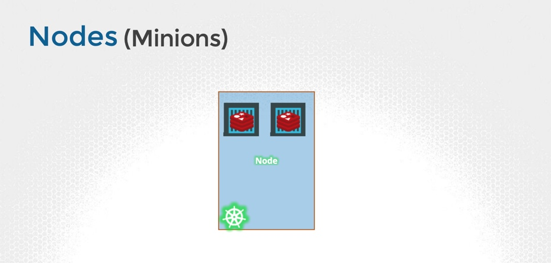

- Kubernetes is configured on one or more Nodes. 
- A node is a machine – physical or
virtual – on which kubernetes is installed. A node is a worker machine and this is were containers are hosted.
- It was also known as Minions in the past. So you might here these terms used inter changeably.


- But what if the node on which our application is running fails? Well, obviously our application goes down. - So you need to have more than one nodes for high availability and scaling.

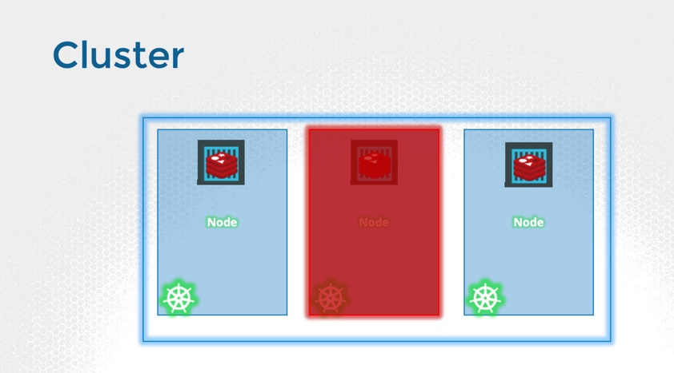

- A cluster is a set of nodes grouped together. 
- This way even if one node fails you have
your application still accessible from the other nodes.
- Moreover having multiple nodes helps in sharing load as well.

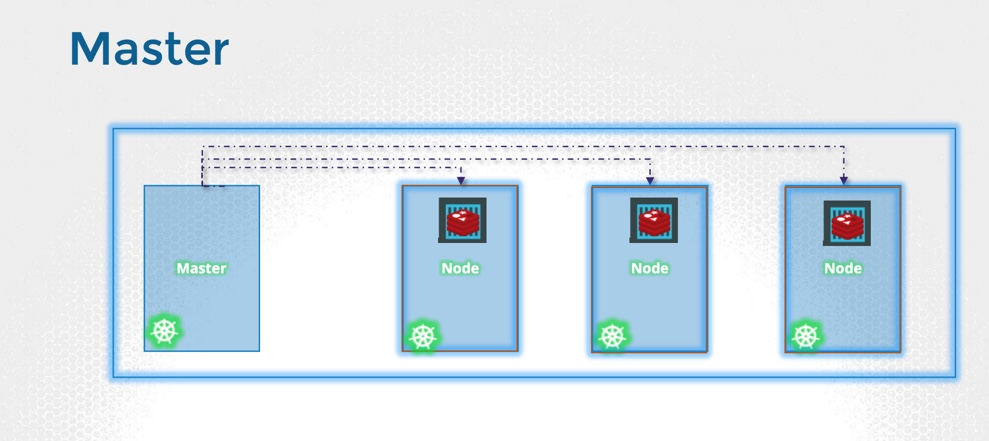

- Now we have a cluster, but who is responsible for managing the cluster? Were is the information about the members of the cluster stored? How are the nodes monitored? When a node fails how do you move the workload of the failed node to another worker node? 
- That’s were the Master comes in. 
- The master is another node with Kubernetes installed in it, and is configured as a Master. 
- The master watches over the nodes in the cluster and is responsible for the actual orchestration of containers on the worker nodes. 


- When you install Kubernetes on a System, you are actually installing the following
components: 
    - An API Server. 
    - An ETCD service. 
    - A kubelet service. 
    - A Container Runtime
    - Controllers and Schedulers.
  
- The API server acts as the front-end for kubernetes. The users, management devices, Command line interfaces all talk to the API server to interact with the kubernetes
cluster.
- Next is the ETCD key store. ETCD is a distributed reliable key-value store used by kubernetes to store all data used to manage the cluster. 
- Think of it this way, when you have multiple nodes and multiple masters in your cluster, etcd stores all that information on all the nodes in the cluster in a distributed manner. 
- ETCD is responsible for implementing locks within the cluster to ensure there are no conflicts between the Masters.
- The scheduler is responsible for distributing work or containers across multiple nodes. 
- It looks for newly created containers and assigns them to Nodes.
- The controllers are the brain behind orchestration.
- They are responsible for noticing and responding when nodes, containers or endpoints goes down. 
- The controllers makes decisions to bring up new containers in such cases.
- The container runtime is the underlying software that is used to run containers. 
- In our case it happens to be Docker.
- And finally kubelet is the agent that runs on each node in the cluster. 
- The agent is responsible for making sure that the containers are running on the nodes as expected.
- An additional component on the Node is the kube-proxy. - It takes care of networking within Kubernetes.


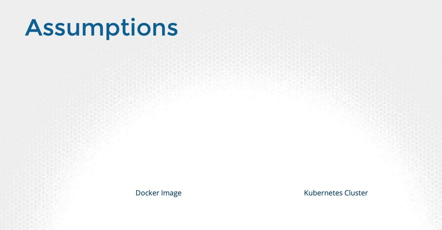
- Before we head into understanding PODs, we would like to assume that the following have been setup already. 
  - At this point, we assume that the application is already developed and built into Docker Images and it is available on a Docker repository like Docker hub or any other internal registry, so kubernetes can pull it down. 
  - We also assume that the Kubernetes cluster has already been setup and is working. This could be a single-node setup or a multi-node setup, doesn’t matter. All the services need to be in a running state.

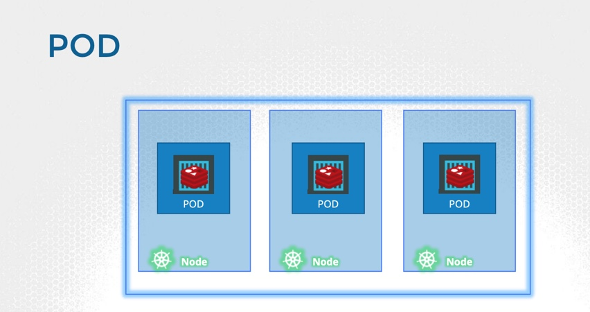
- With kubernetes our ultimate aim is to deploy our
application in the form of containers on a set of machines that are configured as worker nodes in a cluster. 
- However, kubernetes does not deploy containers directly on the worker nodes. 
- The containers are encapsulated into a Kubernetes object known as PODs. 
- **A POD is a single instance of an application. A POD is the smallest object, that you can create in kubernetes.**


- Here we see the simplest of simplest cases were you have a single node kubernetes cluster with a single instance of your application running in a single docker container encapsulated in a POD. 
- What if the number of users accessing your application
increase and you need to scale your application? 
- You need to add additional instances of your web application to share the load. 
- Now, were would you spin up additional instances? Do we bring up a new container instance within the same
POD? No! We create a new POD altogether with a new instance of the same
application. 
As you can see we now have two instances of our web application running on two separate PODs on the same kubernetes system or node.
- What if the user base FURTHER increases and your current node has no sufficient capacity? 
- Well THEN you can always deploy additional PODs on a new node in the cluster. 
- You will have a new node added to the cluster to expand the cluster’s physical capacity. 
- SO, what I am trying to illustrate in this slide is that, PODs usually have a one-to-one relationship with containers running your application. 
- To scale UP you create new PODs and to scale down you delete PODs. 

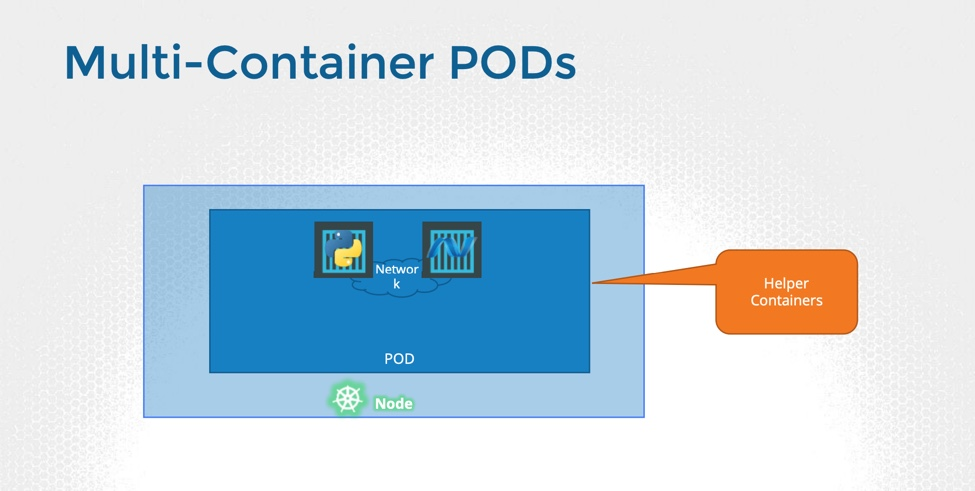

- Now we just said that PODs usually have a one-to-one relationship with the containers, but, are we restricted to having a single container in a single POD? No! 
- A single POD CAN have multiple containers, except for the fact that they are usually not multiple containers of the same kind. 
- As we discussed in the previous slide, if our
intention was to scale our application, then we would need to create additional PODs.  
- But sometimes you might have a scenario were you have a helper container, that might be doing some kind of supporting task for our web application such as
processing a user entered data, processing a file uploaded by the user etc. and you want these helper containers to live along side your application container.
- In that case, you CAN have both of these containers part of the same POD, so that when a new application container is created, the helper is also created and when it dies the helper also dies since they are part of the same POD. 
- The two containers can also communicate with each other directly by referring to each other as ‘localhost’ since
they share the same network namespace. 
- Plus they can easily share the same storage space as well.


- Kubernetes uses YAML files as input for the creation of objects such as PODs, Replicas, Deployments, Services etc. 
- All of these follow similar structure. 
- A kubernetes definition file always contains 4 top level fields. 
  - The apiVersion, 
  - kind,
  - metadata and 
  - spec. 
- These are top level or root level properties. These are all REQUIRED fields, so you MUST
have them in your configuration file.
- The first one is the apiVersion. 
  - This is the version of the kubernetes API we’re using to create the object. 
  - Depending on what we are trying to create we must use the RIGHT apiVersion. 
  - For now since we are working on PODs, we will set the apiVersion as v1. 
  - Few other possible values for this field are apps/v1beta1, extensions/v1beta1 etc.
- Next is the kind. 
  - The kind refers to the type of object we are trying to create, which in this case happens to be a POD. 
  - So we will set it as Pod.
  - Some other possible values here could be ReplicaSet or Deployment or Service, which is what you see in the kind field in the table on the right.
- The next is metadata. 
  - The metadata is data about the object like its name, labels etc.
  - As you can see unlike the first two were you specified a string value, this, is in the form of a dictionary. 
  - So everything under metadata is intended to the right a little bit and so names and labels are children of metadata. Under metadata, the name is a string value – so you can name your POD myapp-pod - and the labels is a dictionary.
  - So labels is a dictionary within the metadata dictionary. 
  - And it can have any key and value pairs as you wish.
  - Similarly you could add other labels as you see fit which will help you identify these objects at a later point in time. 
  - Say for example there are 100s of PODs running a front-end application, and 100’s of them running a backend application or a database, it will be DIFFICULT for you to group these PODs once they are deployed. 
  - If you label them now as front-end, back-end or database, you will be able to filter the PODs based on this label at a later point in time.
**It’s IMPORTANT to note that under metadata, you can only specify name or labels or anything else that kubernetes expects to be under metadata. You CANNOT add any other property as you wish under this. However, under labels you CAN have any kind of key or value pairs as you see fit. So its IMPORTANT to understand what each of these parameters expect.**

- So far we have only mentioned the type and name of the object we need to create which happens to be a POD with the name myapp-pod, but we haven’t really specified the container or image we need in the pod. 
- The last section in the configuration file is the specification which is written as spec. 
- Depending on the object we are going to create, this is were we provide additional information to kubernetes pertaining to that object. 
- This is going to be different for different objects, so its important to understand or refer to the documentation section to get the right format for each. 
- Since we are only creating a pod with a single container in it, it is
easy. 
- Spec is a dictionary so add a property under it called containers, which is a list
or an array. 
- The reason this property is a list is because the PODs can have multiple
containers within them as we learned in the lecture earlier. 
- In this case though, we will only add a single item in the list, since we plan to have only a single container in
the POD. 
- The item in the list is a dictionary, so add a name and image property. 
- The value for image is nginx.
- Once the file is created, run the command kubectl create -f followed by the file name which is pod-definition.yml and kubernetes creates the pod.


- Controllers are the brain behind K8s. They are the processes that monitor the K8s objects and respond accordingly.
- Here we will discuss about one particular controller called **Replication Controller**.
- What is a replica and why do we need a replication controller?


- Let's go back to our scenario where we had a single POD running our application.
- What if for some reason, our application crashes and our POD fails. Users will no longer access our application.
- To prevent users from losing access to our app, we'd like to have more than one instance or POD running at the same time.
- That way if one fails, we still have our app running on the other one.
- The Replication controller helps us run multiple instances of a single app, in the K8s cluster. Thus providing High Availability.
- Does that mean Replication controllers are only applicable for multiple instance scenarios?
- No. Even if we have a single POD, the replication controller can help by automatically bringing up a new POD when the existing one fails.
- Thus, it ensures that the specified number of PODs are running at all times, whether 1 or 100.

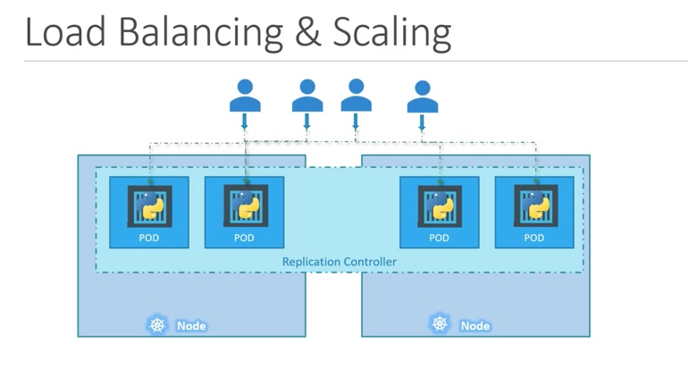

- Another reason we need this, is to create multiple PODs to share load across them.
- For example, in the simple scenario, we have a single POD serving a set of users. When the number of users increase, we deploy additional PODs to balance load across multiple PODs.
- If the demand further increases, and we run out of room on the first **NODE**, we could deploy additional PODs across the other nodes in the cluster.
- The replication controller spans across multiple nodes in the cluster. 


- There are 2 similar terms, Replication Controller and Replica Set.
- Both have the same purpose, but they are not the same.
- Replication controller is the older technology that is being repliced by Replica Set.
- Replica Set is the new recommended way to setup replication.
- However, whatever we discussed in the previous slides, remain applicable to both.
- There are minor differences in how they operate.
- We will try to stick to Replica Set in our demos going forward.

### Defining a Replication Controller

- Let's now look at how we create a Replication Controller
- We will start by creating a Replication Controller definition file. Let's call it **rc-definition.yaml**.
- As with any K8s definition file, we have 4 sections.
  - apiVersion: v1 (this is always specific to the resource we are creating)
  - kind: ReplicationController
  - metadata:
    - name: myapp-rc
    - labels:
      - app: myapp
      - type: front-end
  - spec:
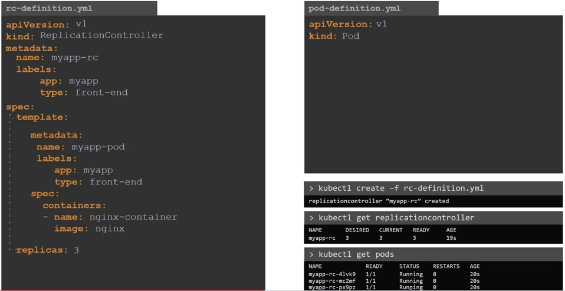
- The replication controller creates multiple instances of a POD. But what POD? 
- This is defined in the **spec** section in the above file by defining a template.
- How do we define the POD template? Already done in the previous exercise? (pod-definition.yaml)
- We could re-use the contents of the file to populate the template section.
- Move all the contents of the **metadata** and **spec** section from the POD defnition file.
- We should now have 2 metadata sections.
- Something missing? How many replicas should the Replication controller create?
- Add another section called **replicas** and put the number of replicas required.
- Once the file is ready, use the **kubectl** create command and input the file using the **-f** parameter.
- The replication controller is created. It first creates the PODs using the POD definition the template.
- To view the list of created replication controller run the **kubectl get replicationcontroller** command.
- If you'd like to see the PODs created by the replication controller, run the **kubectl get pods** command.

### Defining Replica Set
- It is very similar to replication controller.
- As usual we will have the same 4 required fields in the definition file, except that the **apiVersion** is **apps/v1** instead of **v1** in case of Replication Controller.
- **kind** would be **ReplicaSet**.
- **spec** section looks very similar to Replication Controller. This will have the same contents of **template** from the Replication Controller.
- **However there is one major difference. ReplicaSet requires a **selector** section**.

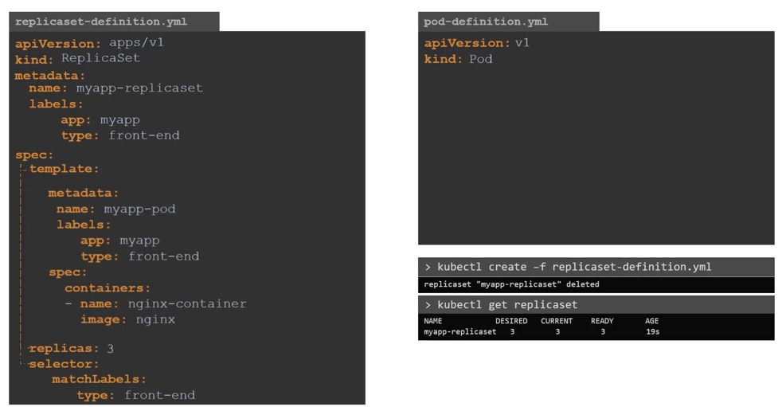

- The selector section defines what PODs fall under it.
- Why provide this information if the POD definition itself is within the same file? This is because ReplicaSet can also manage PODs that were not created as part of the replica set creation.
- For example, if there were PODs created before the creation of the replica set, replica set would also consider them in the definition based on the selectors.
- **selector** is NOT required in Replication Controller, but is still available.
- To list the selectors, we use the same labels provided for the POD by using **matchLabels**.
- The **matchLabels** simply selects the PODs matching the labels specified.


- Why do we label our resources in K8s?
- Let's look a simple scenario. Say we deployed a POD as our front-end app, and we also need 3 instances of this to be running all the time.
- To achieve this we will have to define a Replica Set.
- In case if the PODs were not created before defining the Replica Set, it will create it for us.
- How does the replica set know what PODs to monitor? There could be 1000's of other PODs running.
- This is where labeling our PODs during creation comes-in handy.
- We can provide these labels as selector in the replica set.
- Same concept of labels and selector is used in several other places in K8s.
  
## Scaling
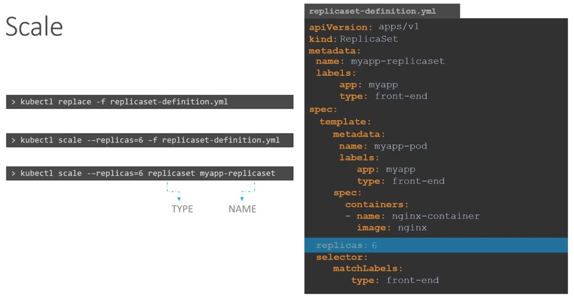

## Deployments
- How do we deploy our application in a PROD environment?
- For example, a web server that needs to be deployed in PROD, and have many instances of such server running at all time. Secondly, we will want to upgrade the docker instance to the latest version.
- However, we want to upgrade them with less impact to the user.
- Updating the servers one after the other will create less impact to the user. This is called **Rolling Update**.
- If something fails during update, we can **Rollback** the changes that were recently carried out.
- Finally, we can make multiple changes to the environment, such as upgrading the version, scaling the environment, and also increasing the resources available.
- All of these can be achieved using **Deployments**
- PODs deploy single instance of our application, such as the web application.
- Each container is encapsulating in a POD.
- Multiple such PODs are deployed using ReplicaSets.
- And then comes, **Deployments**, which is a K8s object that comes higher in the hierarchy.
- It provides us the capability to upgrade the underlying instances using rolling updates, undo changes, resume changes etc.
- How do we create a Deployment?
- As with the previous components, we create a definition file.
- Contents of the file are exactly same as that of the replicaset, except that **kind** is **deployment**.


**Create an NGINX Pod**

    kubectl run --generator=run-pod/v1 nginx --image=nginx


**Generate POD Manifest YAML file (-o yaml). Don't create it(--dry-run)**

    kubectl run --generator=run-pod/v1 nginx --image=nginx --dry-run -o yaml


**Create a deployment**

    kubectl run --generator=deployment/v1beta1 nginx --image=nginx

Or the newer recommended way:

    kubectl create deployment --image=nginx nginx

**Generate Deployment YAML file (-o yaml). Don't create it(--dry-run)**
    kubectl run --generator=deployment/v1beta1 nginx --image=nginx --dry-run -o yaml

Or

    kubectl create deployment --image=nginx nginx --dry-run -o yaml

**Generate Deployment YAML file (-o yaml). Don't create it(--dry-run) with 4 Replicas (--replicas=4)**

    kubectl run --generator=deployment/v1beta1 nginx --image=nginx --dry-run --replicas=4 -o yaml

kubectl create deployment does not have a --replicas option. You could first create it and then scale it using the kubectl scale command.

Save it to a file - (If you need to modify or add some other details)

    kubectl run --generator=deployment/v1beta1 nginx --image=nginx --dry-run --replicas=4 -o yaml > nginx-deployment.yaml

- Create a Service named nginx of type NodePort and expose it on port 30080 on the nodes:

    kubectl create service nodeport nginx --tcp=80:80 --node-port=30080 --dry-run -o yaml

- Reference:

    https://kubernetes.io/docs/reference/kubectl/conventions/

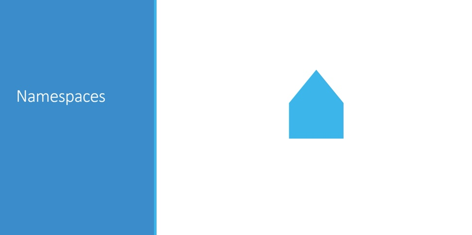

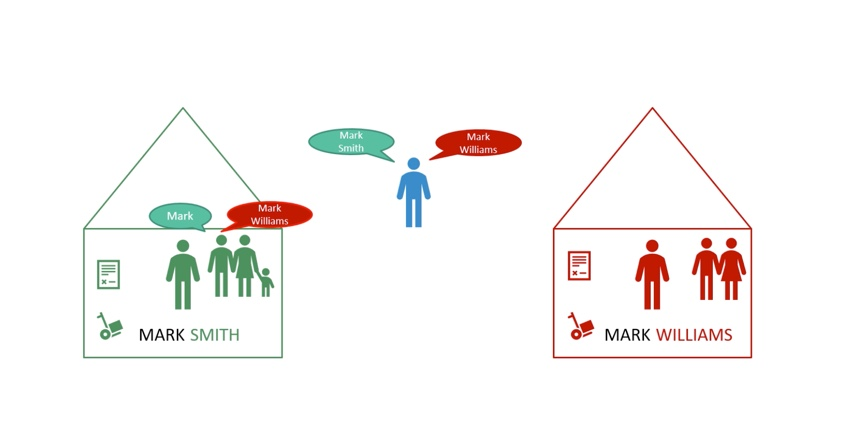
- In K8s, the houses above, are referred as **Namespaces**.
- The resources include, PODs, deployments, services etc.
- We have all been creating the resources so far in a Namespace. The **default** namespace.
- Kubernetesd itself creates some resources that it needs for operation in the **kube-system** namespace.
- The third namespace, called **kube-public**, this is where resources that must be made available to all users are created.

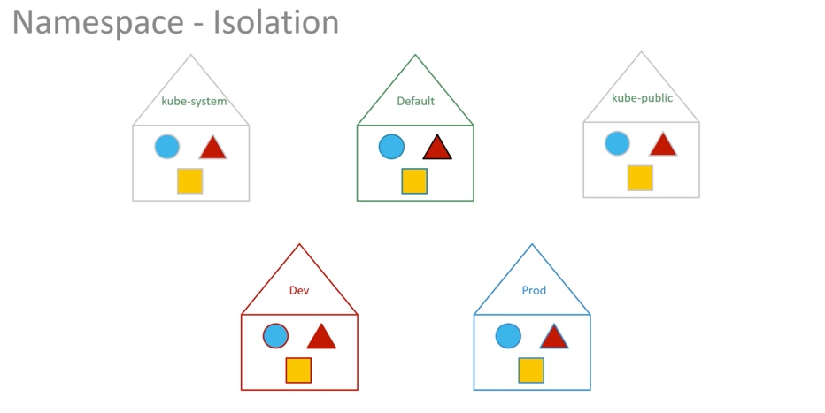

- Each of these Namespaces can have a list of policies that define who can do what?
- Resources can also be alloted differently to each of the namespaces.
- The resources within the same namespace can talk to each other using their names alone.
- Services can talk to other services in a different namespace as well, by appending the name of the other namespace.
- When a service is created, a DNS entry is automatically created.
- Looking closely at the DNS entry, the last part **cluster.local** is the default domain name of K8s.
- **svc** is the subdomain for the service. Followed by the Namespace and the name of the service itself.

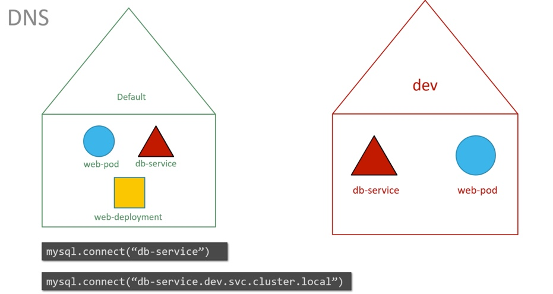

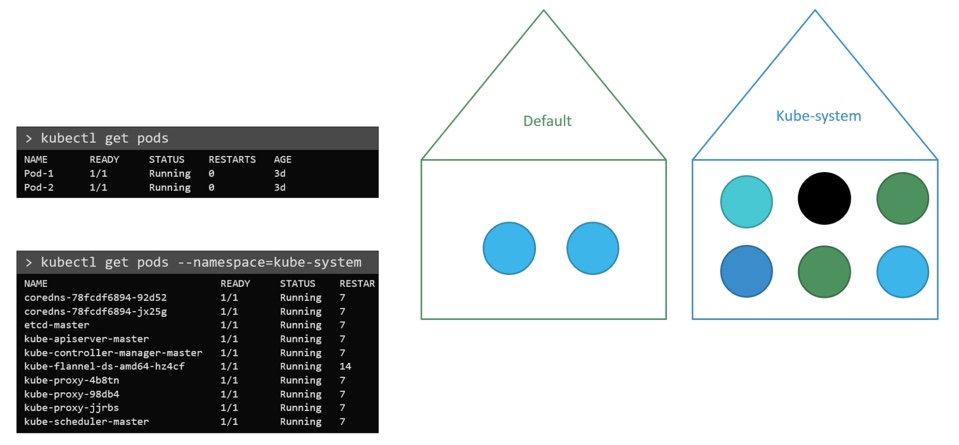

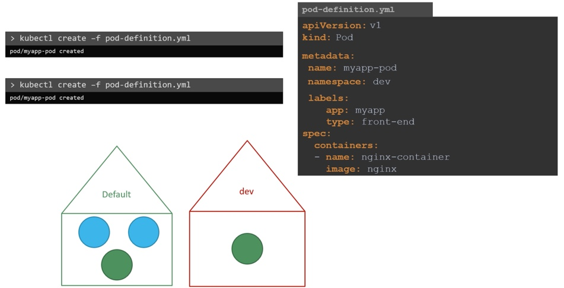

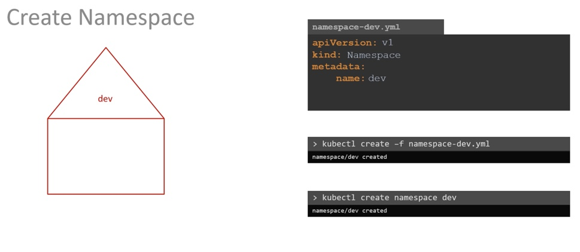

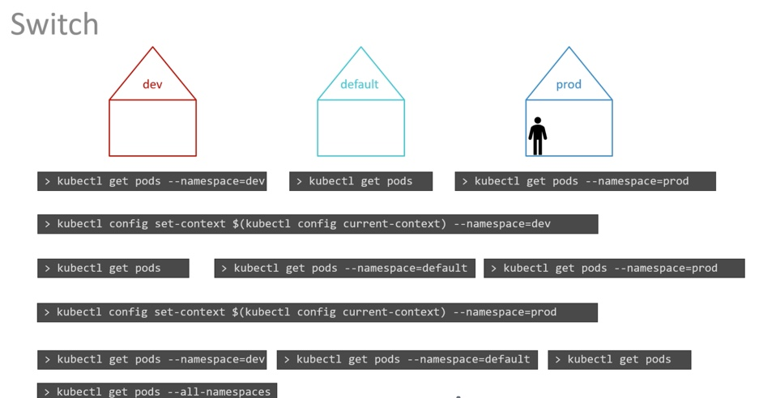

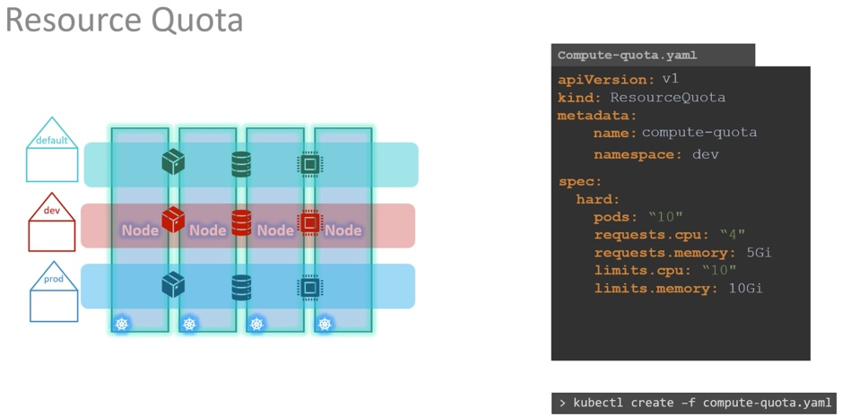


# Exercises


## Creating a Pod and Inspecting it

1. Create the namespace `ckad-prep`.
2. In the namespace `ckad-prep` create a new Pod named `mypod` with the image `nginx:2.3.5`. Expose the port 80.
3. Identify the issue with creating the container. Write down the root cause of issue in a file named `pod-error.txt`.
4. Change the image of the Pod to `nginx:1.15.12`.
5. List the Pod and ensure that the container is running.
6. Log into the container and run the `ls` command. Write down the output. Log out of the container.
7. Retrieve the IP address of the Pod `mypod`.
8. Run a temporary Pod using the image `busybox`, shell into it and run a `wget` command against the `nginx` Pod using port 80.
9. Render the logs of Pod `mypod`.
10. Delete the Pod and the namespace.

<details><summary>Show Solution</summary>
<p>

First, create the namespace.

```bash
$ kubectl create namespace ckad-prep
```

Next, create the Pod in the new namespace.

```bash
$ kubectl run mypod --image=nginx:2.3.5 --restart=Never --port=80 --namespace=ckad-prep
pod/mypod created
```

You will see that the image cannot be pulled as it doesn't exist with this tag.

```bash
$ kubectl get pod -n ckad-prep
NAME    READY   STATUS             RESTARTS   AGE
mypod   0/1     ImagePullBackOff   0          1m
```

The list of events can give you a deeper insight.

```bash
$ kubectl describe pod -n ckad-prep
...
Events:
  Type     Reason                 Age                 From                         Message
  ----     ------                 ----                ----                         -------
  Normal   Scheduled              3m3s                default-scheduler            Successfully assigned mypod to docker-for-desktop
  Normal   SuccessfulMountVolume  3m2s                kubelet, docker-for-desktop  MountVolume.SetUp succeeded for volume "default-token-jbcl6"
  Normal   Pulling                84s (x4 over 3m2s)  kubelet, docker-for-desktop  pulling image "nginx:2.3.5"
  Warning  Failed                 83s (x4 over 3m1s)  kubelet, docker-for-desktop  Failed to pull image "nginx:2.3.5": rpc error: code = Unknown desc = Error response from daemon: manifest for nginx:2.3.5 not found
  Warning  Failed                 83s (x4 over 3m1s)  kubelet, docker-for-desktop  Error: ErrImagePull
  Normal   BackOff                69s (x6 over 3m)    kubelet, docker-for-desktop  Back-off pulling image "nginx:2.3.5"
  Warning  Failed                 69s (x6 over 3m)    kubelet, docker-for-desktop  Error: ImagePullBackOff
```

Go ahead and edit the existing Pod. Alternatively, you could also just use the `kubectl set image pod mypod mypod=nginx --namespace=ckad-prep` command.

```bash
$ kubectl edit pod mypod --namespace=ckad-prep
```

After setting an image that does exist, the Pod should render the status `Running`.

```bash
$ kubectl get pod -n ckad-prep
NAME    READY   STATUS    RESTARTS   AGE
mypod   1/1     Running   0          14m
```

You can shell into the container and run the `ls` command.

```bash
$ kubectl exec mypod -it --namespace=ckad-prep  -- /bin/sh
/ # ls
bin  boot  dev	etc  home  lib	lib64  media  mnt  opt	proc  root  run  sbin  srv  sys  tmp  usr  var
/ # exit
```

Retrieve the IP address of the Pod with the `-o wide` command line option.

```bash
$ kubectl get pods -o wide -n ckad-prep
NAME    READY   STATUS    RESTARTS   AGE   IP               NODE
mypod   1/1     Running   0          12m   192.168.60.149   docker-for-desktop
```

Remember to use the `--rm` to create a temporary Pod.

```bash
$ kubectl run busybox --image=busybox --rm -it --restart=Never -n ckad-prep -- /bin/sh
If you don't see a command prompt, try pressing enter.
/ # wget -O- 192.168.60.149:80
Connecting to 192.168.60.149:80 (192.168.60.149:80)
<!DOCTYPE html>
<html>
<head>
<title>Welcome to nginx!</title>
<style>
    body {
        width: 35em;
        margin: 0 auto;
        font-family: Tahoma, Verdana, Arial, sans-serif;
    }
</style>
</head>
<body>
<h1>Welcome to nginx!</h1>
<p>If you see this page, the nginx web server is successfully installed and
working. Further configuration is required.</p>

<p>For online documentation and support please refer to
<a href="http://nginx.org/">nginx.org</a>.<br/>
Commercial support is available at
<a href="http://nginx.com/">nginx.com</a>.</p>

<p><em>Thank you for using nginx.</em></p>
</body>
</html>
-                    100% |**********************************************************************|   612  0:00:00 ETA
/ # exit
```

The logs of the Pod should show a single line indicating our request.

```bash
$ kubectl logs mypod -n ckad-prep
192.168.60.162 - - [17/May/2019:13:35:59 +0000] "GET / HTTP/1.1" 200 612 "-" "Wget" "-"
```

Delete the Pod and namespace after you are done.

```bash
$ kubectl delete pod mypod --namespace=ckad-prep
pod "mypod" deleted
$ kubectl delete namespace ckad-prep
namespace "ckad-prep" deleted
```

</p>
</details>
